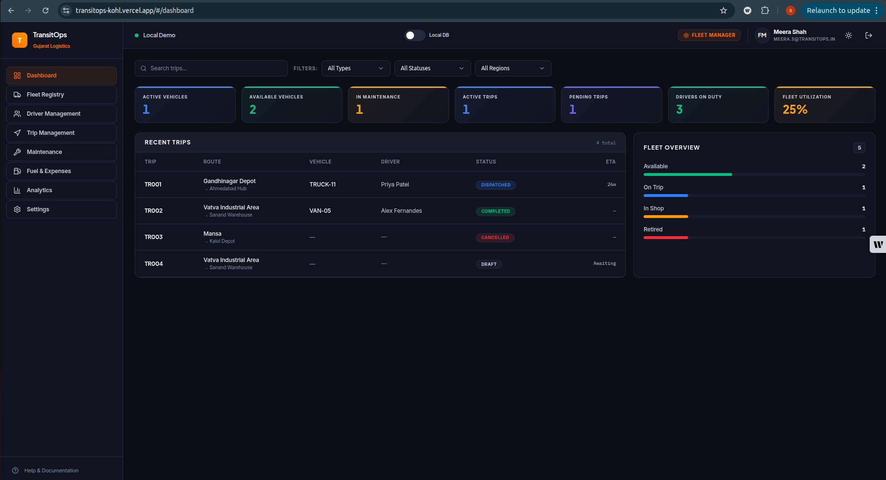
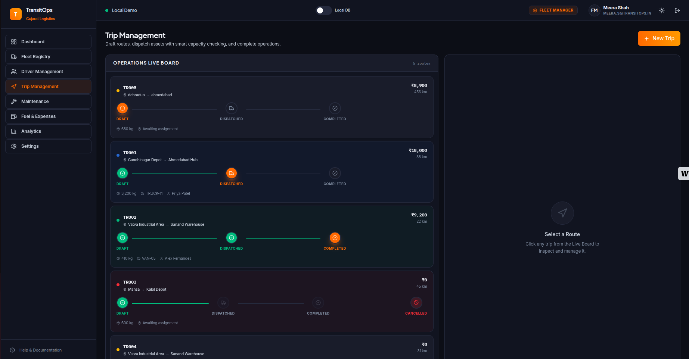
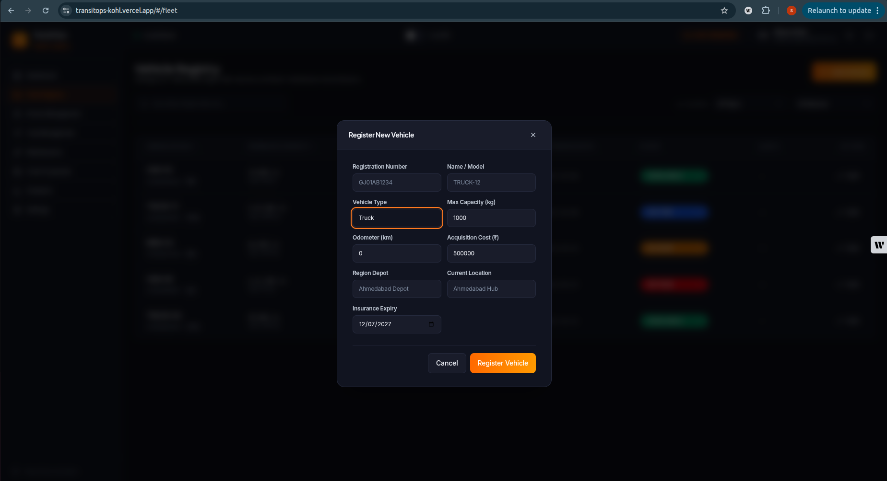

<p align="center">
  
</p>

<p align="center">
  
  
  
  
  
  
  
  
</p>

# TransitOps: Smart Transport Operations Platform

*An end-to-end transport operations platform built to digitize and streamline fleet management, routing, and expense tracking.*

---

## Table of Contents
- [Workspace Structure](#workspace-structure)
- [Overview](#overview)
- [User Roles (RBAC)](#user-roles-rbac)
- [Smart Business Rules (Automated)](#smart-business-rules-automated)
- [Key Features Implemented](#key-features-implemented)
- [System Architecture](#system-architecture)
- [Screenshots](#screenshots)
- [Getting Started](#getting-started)
- [License](#license)

---

## Workspace Structure
```
TransitOps/
├── assets/                          <-- Project-level static media (logos, screenshots, diagrams)
│   ├── logo.png
│   ├── dashboard.png
│   ├── dispatch.png
│   ├── fleet.png
│   ├── system-architecture.png
│   └── dispatch-automation-framework.png
│
├── backend/                         <-- Express.js API server (Hybrid: db.json + PostgreSQL/Supabase)
│   ├── db.json                      <-- Local demo flat-file database (seed + runtime fallback)
│   ├── server.js                    <-- Main Express server: /api/data, /api/dispatch/recommend, /api/save
│   ├── schema.sql                   <-- Supabase/PostgreSQL schema with ENUMs, FK, constraints & RLS policies
│   ├── seed.js                      <-- Script to seed PostgreSQL tables from db.json
│   ├── setup_linux.sh               <-- One-shot setup script for local Linux environment
│   ├── package.json                 <-- Backend dependencies (express, cors, pg)
│   └── odoo_framework/              <-- Odoo bundle (future ERP integration layer)
│
├── frontend/                        <-- React 19 + Vite 8 + TypeScript + Tailwind CSS v4
│   ├── src/
│   │   ├── components/              <-- Reusable UI primitives and shared widgets
│   │   │   ├── primitives.tsx       <-- Base UI kit: Button, Input, Field, Badge, cx utility
│   │   │   ├── ActivityFeed.tsx     <-- Real-time audit log widget
│   │   │   ├── KpiCard.tsx          <-- Dashboard KPI stat card
│   │   │   └── StatusBadge.tsx      <-- Color-coded status pill badge
│   │   ├── context/                 <-- React Context providers (global state)
│   │   │   ├── AuthContext.tsx      <-- Authentication state + login/logout actions
│   │   │   └── ToastContext.tsx     <-- Global toast notification system
│   │   ├── hooks/
│   │   │   └── useDb.ts             <-- Custom hook to subscribe to the Database singleton
│   │   ├── lib/                     <-- Core business logic and data layer
│   │   │   ├── db.ts                <-- Database class: all CRUD, business rules, localStorage + backend sync
│   │   │   ├── dispatchLogic.ts     <-- Automation Dispatch Network: Phases A–D matching algorithm
│   │   │   ├── format.ts            <-- Formatting helpers (currency, date, distance)
│   │   │   ├── id.ts                <-- Deterministic UID generator (uid prefix function)
│   │   │   ├── permissions.ts       <-- RBAC permission matrix and role label maps
│   │   │   └── seed.ts              <-- Frontend seed data (SEED_VEHICLES, SEED_DRIVERS, etc.)
│   │   ├── pages/                   <-- Full-page module views (one per sidebar nav item)
│   │   │   ├── Dashboard.tsx        <-- Live KPIs, fleet utilization chart, activity feed
│   │   │   ├── Fleet.tsx            <-- Vehicle registry, maintenance due flags, ROI ledger, CSV export
│   │   │   ├── Drivers.tsx          <-- Driver registry, license expiry countdowns, safety scores
│   │   │   ├── Trips.tsx            <-- Trip lifecycle management + Smart Dispatch Assist modal
│   │   │   ├── Maintenance.tsx      <-- Maintenance log, open/close service records
│   │   │   ├── FuelExpenses.tsx     <-- Fuel log + expense ledger with cost anomaly highlights
│   │   │   ├── Analytics.tsx        <-- Charts and reports (revenue, cost breakdown, utilization)
│   │   │   └── Settings.tsx         <-- DB reset, backend toggle, system info
│   │   ├── App.tsx                  <-- Root app shell: SPA routing, auth guard, sidebar, topbar
│   │   ├── main.tsx                 <-- Vite entry point (ReactDOM.createRoot)
│   │   ├── types.ts                 <-- All shared TypeScript interfaces and enums
│   │   └── index.css                <-- Global CSS: design tokens, Tailwind base, animations
│   ├── public/                      <-- Static public assets served by Vite
│   ├── index.html                   <-- Vite HTML entry template
│   ├── package.json                 <-- Frontend dependencies (react, lucide-react, recharts, tailwindcss)
│   ├── vite.config.ts               <-- Vite config (React plugin, port setup)
│   ├── tsconfig.json                <-- TypeScript root config
│   └── tsconfig.app.json            <-- TypeScript app-specific compiler options
│
└── README.md                        <-- Master documentation (this file)
```

---

## Overview
Many logistics companies still rely on spreadsheets and manual logbooks, leading to scheduling conflicts, missed maintenance, and poor operational visibility. **TransitOps** is a centralized platform designed to manage the complete lifecycle of transport operations—from vehicle registration and driver management to dispatching, maintenance, fuel logging, and analytics.

**Hackathon Note:** This system was conceptualized, built, and verified within an 8-hour development window as a premium operations portal.

---

## User Roles (RBAC)
TransitOps implements strict **Role-Based Access Control (RBAC)**. Sidebars and screen views hide or show based on permissions:
*   **Fleet Manager:** Full access to Fleet Registry and Maintenance logs. Restricted from direct Dispatching and Fuel expenses.
*   **Dispatcher:** Full access to Trip Dispatcher. View-only access to Fleet and Maintenance. Restricted from other logs.
*   **Safety Officer:** Full access to Drivers registry. View-only access to Trips. Restricted from editing fleet/finance records.
*   **Financial Analyst:** Full access to Fuel & Expenses. View-only access to Fleet, Maintenance, and Reports. Restricted from dispatch/driver registries.

*Demo Override:* A header dropdown allows developers and judges to change active roles on-the-fly to test RBAC and RLS-like enforcement live.

---

## Smart Business Rules (Automated)
To prevent operational mistakes, TransitOps implements a state machine governed by 9 non-negotiable rules:
1.  **Unique Reg No:** Every vehicle registration plate is strictly unique.
2.  **Dispatch Status Restriction:** "Retired" or "In Shop" vehicles cannot be dispatched.
3.  **Driver Compliance:** Drivers with expired licenses or "Suspended" status cannot be assigned.
4.  **Single Active Trip:** Vehicles or drivers already active "On Trip" are locked from new dispatches.
5.  **Load Limits:** Cargo weight cannot exceed the assigned vehicle's maximum capacity (checked dynamically).
6.  **Dispatch State Shift:** Dispatching a trip auto-flips both driver & vehicle status to `On Trip`.
7.  **Completed State Shift:** Completing a trip updates odometer mileage, logs fuel, and resets driver/vehicle status to `Available`.
8.  **Cancellation Restoration:** Cancelling a dispatched trip restores the driver and vehicle to `Available`.
9.  **Maintenance Isolation:** Logging vehicle maintenance sets the vehicle status to `In Shop`. Closing the service restores it to `Available` (unless Retired).

---

## Key Features Implemented
*   **Live Dashboard & KPIs:** Fleet Utilization %, Active/Available Vehicles, In Maintenance count, Active/Pending Trips, and Drivers On Duty.
*   **Smart Dispatch Assist:** Allocation forms auto-filter dropdowns to show only eligible vehicles (matching capacity limits) and active drivers. Includes validation block banners.
*   **Live Activity Feed:** Real-time audit log widget showing system transitions in real time.
*   **Responsive table sorting and filters:** Quickly scan and segment assets, trips, and expenses.
*   **License Expiry Countdowns:** Badges showing remaining valid days for driver licenses (Red for Expired/Critical (<30d), Amber (<90d)).
*   **Maintenance Due Indicators:** Flagging vehicles with warning badges if they exceed 10,000 km since their last service.
*   **Cost Anomaly Highlights:** Flags vehicles spending 25% above the fleet average cost.
*   **Compliance & Proximity Fields:** Vehicles and drivers track insurance expiry and current location for dispatch matching and safety review.
*   **CSV Data Export:** Client-side CSV download of vehicle ROI ledger.
*   **Pre-seeded Demo Dataset:** Coherent dataset utilizing Gujarat registrations, INR currency, and regional route paths (Ahmedabad/Gandhinagar).
*   **Vibrant Dark UI:** Modern theme utilizing curated harmonious palettes (green, amber, blue, red) and micro-animations.

---

## System Architecture

<p align="center">
  
</p>

<details>
<summary><strong>TransitOps System Architecture Overview</strong></summary>

**Frontend Client (React + Vite + TypeScript + Tailwind v4)**

* **User Interface:** A fast, responsive, dark-themed portal tailored for logistics operations.
* **Role-Based Access Control (RBAC):** Automatically hides or shows specific modules based on the user's role (e.g., Financial Analyst vs. Dispatcher).
* **Client-Side Validation:** Instantly checks business rules (like vehicle load limits and driver availability) in the browser before sending data to the server.

**Backend & Database (Supabase + PostgreSQL Draft)**

* **Authentication:** Manages secure user logins and issues role-based access tokens.
* **Relational Database:** The schema draft stores Vehicles, Drivers, Trips, Maintenance, Fuel, Expenses, and Activity.
* **Strict Constraints:** Unique plate/license constraints, enum-based statuses, and safe `SET NULL` trip foreign keys are defined in the schema draft.
* **Operational Scope:** Hackathon reporting keeps operational cost to **Fuel + Maintenance** only; trip expenses remain a separate ledger.

</details>

---

---

## Automated Dispatch Recommendation Engine

<p align="center">
  
</p>

<details>
<summary><strong>How the Dispatch Engine Works</strong></summary>

The dispatch engine connects the Drivers Directory and Trucks Data Directory to a logic layer that recommends optimal driver + truck pairings for every new order, without manual matching.

**1. Human Resource Layer — Drivers Directory**
Tracks identity, compliance (license expiry), live location/status (Available, On Trip, Off Duty, Suspended), and operational metrics (hours worked today, trips this month, charges).

**2. Asset Layer — Trucks Data Directory**
Segments the fleet into Long Haul, Short Trucks, and Small Carriers, each with identification, compliance (insurance expiry), and maintenance state (Available, On Trip, In Shop, Service Needed).

**3. Logic Layer — Automation Dispatch Network**
- **Phase A – Order Ingestion:** Captures cargo weight, destination, and estimated trip duration.
- **Phase B – Hard-Stop Filter:** Eliminates trucks that are unavailable, need service, or have expired insurance; eliminates drivers who are unavailable, unlicensed, or would exceed daily hour limits.
- **Phase C – Smart Matchmaker:** Matches remaining eligible resources by cargo-capacity fit, driver proximity to pickup, and combined cost of driver + truck charges.
- **Phase D – Final Output:** Presents 1–3 ranked driver + truck combinations with a one-click Dispatch action that updates all statuses instantly.

</details>

---

## Screenshots

<p align="center">
  
  <br/>
  <em>Live Dashboard & KPIs</em>
</p>

<p align="center">
  
  <br/>
  <em>Smart Dispatch Assist</em>
</p>

<p align="center">
  
  <br/>
  <em>Fleet Registry & Maintenance Tracking</em>
</p>

---

## Getting Started

### Prerequisites
- Node.js (v18+)
- npm

### Installation & Run
1. Navigate to the frontend directory:
   ```bash
   cd frontend
   ```
2. Install dependencies:
   ```bash
   npm install
   ```
   > Optional: use `npm install --legacy-peer-deps` if package compatibility warnings appear.
3. Start the local development server:
   ```bash
   npm run dev
   ```
4. Build for production:
   ```bash
   npm run build
   ```

---
## Future Scalability Scope

### Six clear steps 

1. Architecture & Tenant Isolation
- Redesign the data model to separate each customer (tenant) so their data is kept private and isolated.
- Add a tenant context so requests and data always belong to a specific customer.
- Add simple feature rules so different plans can enable or limit features.

2. Production REST API
- Build a proper API with clear endpoints for vehicles, drivers, trips, maintenance, and reports.
- Add input checks, pagination, and consistent error responses so integrations behave reliably.
- Support bulk imports and transactional operations for safe, repeatable data changes.

3. Billing & Subscriptions
- Integrate a payment provider and add a billing flow for plans (starter, professional, enterprise).
- Meter usage and enforce quotas for each plan (vehicle limits, API calls, users, etc.).
- Provide webhook handling for payment events and automated plan changes.

4. Frontend & Tenant UX
- Move the app from local demo data to API-driven flows with token-based authentication.
- Add tenant-aware settings, signup, and upgrade flows so organizations can onboard themselves.
- Replace plain-demo authentication with secure sessions and role-aware UI.

5. Cloud Deployment & Operations
- Containerize the backend and deploy with infrastructure-as-code (IaC) and orchestration (cloud-managed services or Kubernetes).
- Add managed databases, caching, CDN for static assets, and autoscaling for reliability.
- Implement monitoring, logging, and health checks to keep the service observable and debuggable.

6. Enterprise Features & Integrations
- Strengthen security with MFA, single sign-on (SSO), and encrypted secrets management.
- Add multi-currency and localization settings to support global customers.
- Provide scheduled reporting, exports, webhooks, and a partner/reseller program for integrations.

### Timeline and priority 
- A staged approach works best: focus first on tenant isolation and a proper REST API, then billing and frontend migration, followed by cloud infra and enterprise features.
- A typical phased rollout can take several months with cross-functional effort (engineering, QA, and DevOps).

---

---
*Developed for modern logistics.*

---

## License
This project is licensed under the **MIT License**. See the [LICENSE](./LICENSE) file for details.

---

